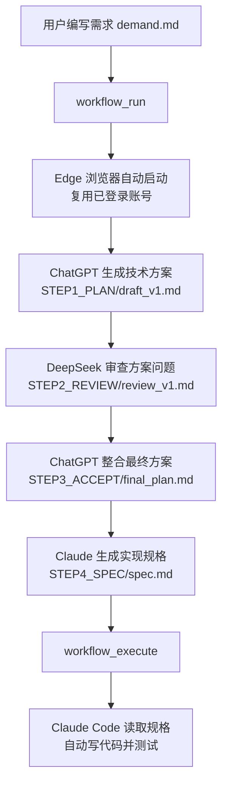

# ai-workflow-mcp-browser
在 Claude Code 中通过一条指令，驱动 Edge/Chrome 浏览器自动访问多个 AI 网站，完成从需求分析→方案生成→交叉审查→规格输出→代码实现的全自动化开发流程。**无需任何 API Key**，直接复用浏览器已登录的账号。

## ✨ 核心特性
- 🚫 **零 API Key 依赖**：所有请求通过真实浏览器发出，复用你已登录的 ChatGPT/DeepSeek/Claude 账号
- 🤖 **多 AI 协作流水线**：自动串联不同 AI 的优势，ChatGPT 做方案、DeepSeek 做审查、Claude 写规格
- 📦 **开箱即用**：一键安装脚本，自动配置 MCP 插件和浏览器驱动
- ⚙️ **高度可定制**：自由替换每一步使用的 AI 模型，自定义所有提示词
- 👁️ **可视化执行**：全程可看到浏览器操作过程，也支持后台静默运行
- 📝 **完整文档留存**：自动生成每一步的中间文件，方便追溯和修改

## 🚀 快速开始
### 前置条件
- 已安装 [Claude Code](https://claude.ai/code)
- 已安装 Edge 浏览器（默认）或 Chrome 浏览器
- 已在浏览器中登录 ChatGPT、DeepSeek 和 Claude.ai 账号

### 1. 安装
```bash
# 1. 克隆或下载本仓库到本地
git clone https://github.com/你的用户名/ai-workflow-mcp-browser.git
cd ai-workflow-mcp-browser

# 2. Windows 双击运行 setup.bat
# 自动安装 Python 依赖、浏览器驱动并注册 MCP 插件
setup.bat

# 3. 验证安装
# 打开 Claude Code，输入以下命令，看到 5 个工具即安装成功
/mcp
```

### 2. 运行你的第一个项目
```bash
# 1. 在你的项目目录创建需求文件
mkdir -p my-project/INPUT
cat > my-project/INPUT/demand.md << EOF
开发一个 Python 工具，监控指定目录，自动把下载的文件按扩展名分类到子文件夹。
要求：
- 不使用第三方库
- 记录操作日志
- 处理文件重名冲突
- 支持 JSON 配置文件
EOF

# 2. 在 Claude Code 中运行规划流程（约 5-10 分钟）
workflow_run

# 3. 规划完成后，自动生成代码
workflow_execute
```

## 🛠️ 工作原理


## 📦 完整工具说明
| 工具命令 | 功能说明 |
|---------|---------|
| `workflow_run` | 运行完整的四步规划流程 |
| `workflow_execute` | 生成实现指令，让 Claude Code 开始写代码 |
| `workflow_status` | 查看各步骤完成状态和生成文件大小 |
| `workflow_reset confirm=true` | 删除所有步骤文件，重置流程从头开始 |
| `git_commit message="提交信息"` | 一键提交当前项目状态到 Git |

### 常用可选参数
```bash
# 只运行指定步骤（例如跳过方案生成，重新运行审查和规格）
workflow_run steps=["review", "accept", "spec"]

# 后台静默运行（不显示浏览器窗口）
workflow_run headless=true

# 指定自定义需求文件路径
workflow_run demand_path="C:\projects\myapp\requirements.md"

# 指定代码输出目录
workflow_execute output_dir="C:\projects\myapp\src"
```

## 📁 文件结构
### 项目本身结构
```
ai-workflow-mcp-browser/
├── server.py              # MCP 服务器主入口，处理所有工具调用
├── setup.bat              # Windows 一键安装脚本
├── debug_selector.py      # 网站选择器调试工具
├── scrapers/
│   ├── base.py            # 浏览器公共操作基类
│   ├── dispatcher.py      # AI 网站路由分发器
│   ├── chatgpt.py         # ChatGPT 自动化脚本
│   ├── deepseek.py        # DeepSeek 自动化脚本
│   └── claude.py          # Claude.ai 自动化脚本
└── prompts/
    ├── planner.md         # 方案生成提示词
    ├── reviewer.md        # 方案审查提示词
    ├── accept.md          # 方案整合提示词
    └── spec.md            # 规格文档生成提示词
```

### 运行后生成的项目结构
```
你的项目目录/
├── INPUT/
│   └── demand.md          # 你编写的原始需求
├── STEP1_PLAN/
│   └── draft_v1.md        # ChatGPT 生成的初步技术方案
├── STEP2_REVIEW/
│   └── review_v1.md       # DeepSeek 提出的问题和改进建议
├── STEP3_ACCEPT/
│   └── final_plan.md      # 整合后的最终技术方案
├── STEP4_SPEC/
│   └── spec.md            # 完整的代码实现规格文档
└── PROJECT/               # Claude Code 自动生成的代码目录
```

## ⚙️ 高级自定义
### 1. 修改每一步使用的 AI 网站
编辑 `server.py` 顶部的 `STEP_SITES` 字典：
```python
STEP_SITES = {
    "plan":   "chatgpt",   # 可选："deepseek" / "claude"
    "review": "deepseek",  # 可选："chatgpt" / "claude"
    "accept": "chatgpt",   # 可选："deepseek" / "claude"
    "spec":   "claude",    # 可选："chatgpt" / "deepseek"
}
```

### 2. 自定义提示词
直接编辑 `prompts/` 目录下对应的 `.md` 文件即可，无需修改任何代码：
- `planner.md`：控制 AI 如何生成技术方案
- `reviewer.md`：指定方案审查的维度和标准
- `accept.md`：定义如何整合原始方案和审查意见
- `spec.md`：规定最终规格文档需要包含的内容

### 3. 切换为 Chrome 浏览器
修改 `scrapers/base.py` 中的配置：
```python
# 将 channel 改为 chrome
channel="chrome",
# 将 Edge 用户数据路径改为 Chrome 的路径
EDGE_USER_DATA = Path.home() / "AppData" / "Local" / "Google" / "Chrome" / "User Data"
# 修改使用的 Profile 名称
EDGE_PROFILE = "Profile 1"
```

## ❓ 常见问题
### Q: 运行时报错 "User data directory is already in use"
**解决方法**：关闭所有 Edge/Chrome 窗口后重试。或者在浏览器中新建一个专用 Profile，然后修改 `scrapers/base.py` 中的 `EDGE_PROFILE` 为对应的文件夹名。

### Q: 某个网站无法输入文字或无法抓取回复
**原因**：AI 网站前端更新导致 CSS 选择器失效。
**解决方法**：运行调试工具获取最新的选择器：
```bash
python debug_selector.py chatgpt
python debug_selector.py deepseek
python debug_selector.py claude
```
然后修改对应 scraper 文件中的 `INPUT_SEL`（输入框选择器）和 `RESPONSE_SEL`（回复容器选择器）。

### Q: AI 回复还没生成完就被截断了
**解决方法**：在对应 scraper 文件中调大等待参数：
```python
# 例如在 chatgpt.py 中
reply = wait_for_response_stable(
    page, 
    RESPONSE_SEL, 
    stable_seconds=8.0,  # 增加判定完成前的静止时间
    timeout=400.0        # 增加最长等待时间
)
```

## 🧹 卸载
在命令行中运行以下命令即可完全移除 MCP 插件：
```bash
claude mcp remove ai-workflow-browser
```

## 🤝 贡献指南
欢迎提交 Issue 和 Pull Request！
- 如果发现某个 AI 网站的选择器失效，请提交 PR 更新对应的 scraper
- 如果你有更好的提示词模板，欢迎分享
- 支持更多 AI 网站（如 Gemini、Qwen 等）的贡献非常欢迎

## 📄 许可证
本项目采用 [MIT 许可证](LICENSE) 开源。

## ⚠️ 免责声明
- 本工具仅用于个人学习和开发效率提升
- 使用本工具请遵守各 AI 平台的服务条款
- 对于因使用本工具导致的任何账号问题或损失，本项目不承担责任

---

需要我帮你生成配套的 **LICENSE 文件** 和 **.gitignore 文件** 吗？
